This branch focuses on the ARGO CD implentation. 

Prereq tool:

Helm
kubectl

Steps to install Argocd inside the existing k8s cluster:
1. Create argocd namespace
   
   kubectl create namespace argocd

2. Install Argo CD components:

   kubectl apply -n argocd -f https://raw.githubusercontent.com/argoproj/argo-cd/stable/manifests/install.yaml

3. Check the pods, it should install all the necessary resources like below

   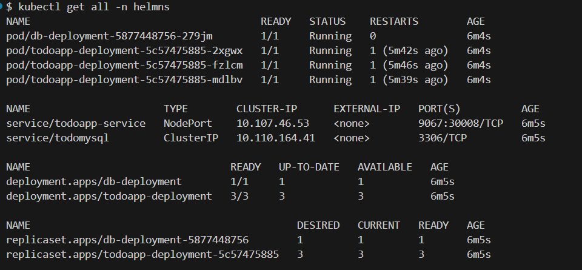

Access the Web UI

1. Check the services, here I have edited the agrocd-server service file to use NodePort

   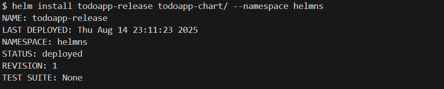

2. Access the server

   

3. User name is admin, password is located in the secret, below is the example

   $kubectl get secrets -n argocd (get the secret resource)

   $kubectl get secret argocd-initial-admin-secret  -n argocd -o yaml (find the password)
   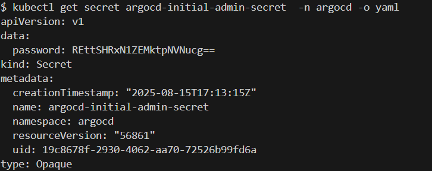

   $ echo "REttSHRxN1ZEMktpNVNucg==" | base64 -d (run this command to get the decoded pass)
   DKmHtq7VD2Ki5Snr

4. Login

Create and run the application in argocd

1. Create namespace where you want to deploy the application 
   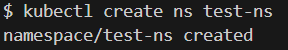

   otherwise the deployment will fail unless it is a default namespace
   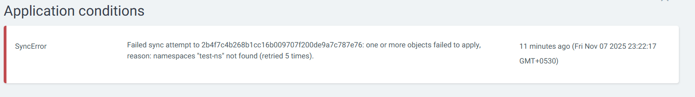

2. Create application and specify the namespace(if used).

3. This will deploy all the resource automatically, and you can also visualise it
   
   Application dashboard
   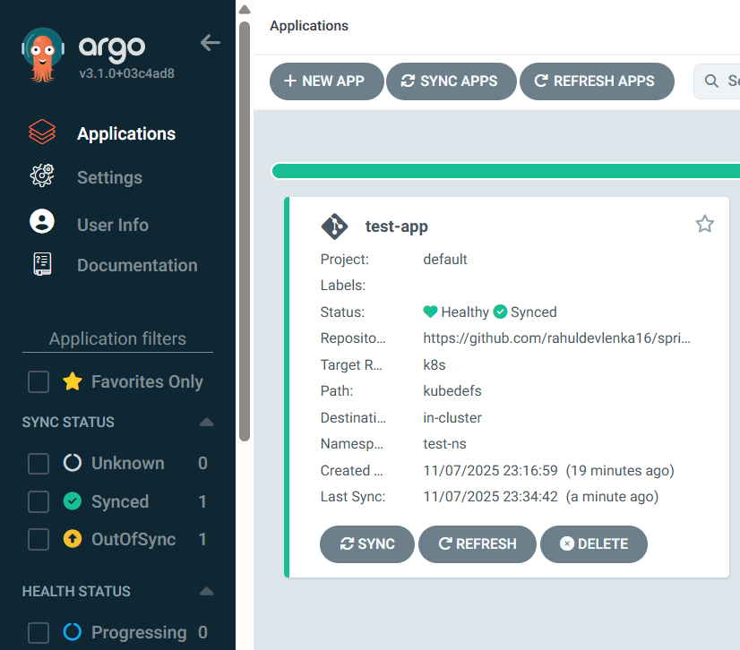

   Tree structure
   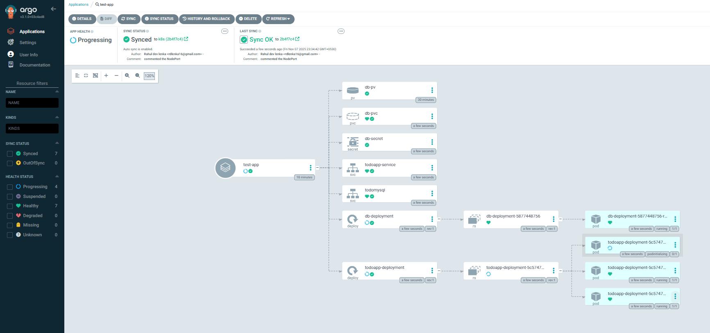

   Network structure
   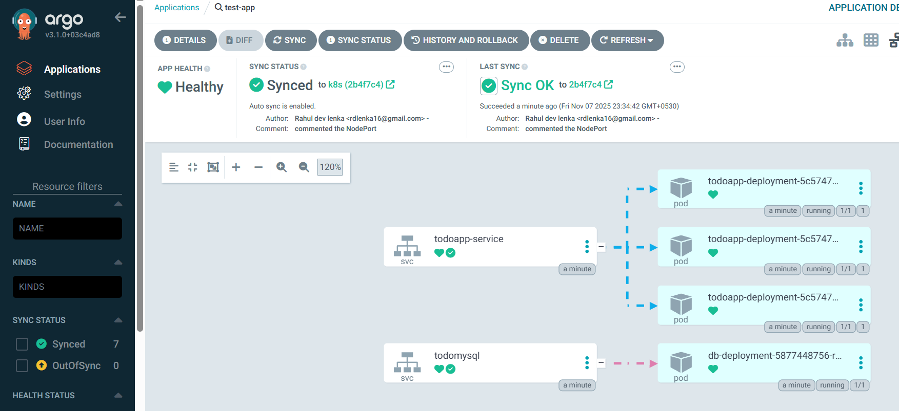

4. Lets check the resources in terminal

   All this resources are deploy by argo CD
   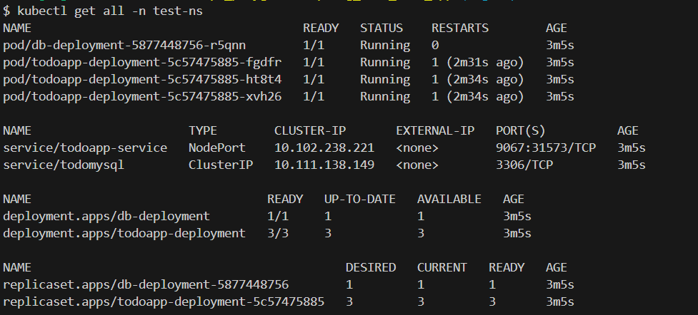

Cleanup

you can just delete the application, it will delete all the resources it created

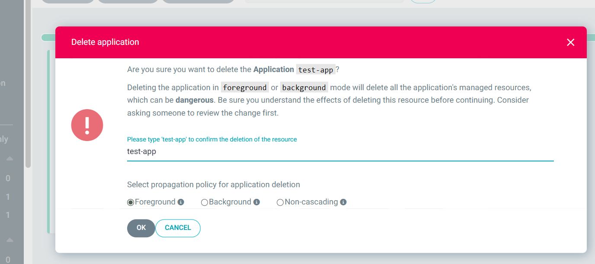
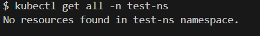

Error detection use case:

One of the service was not able to deploy as the NodePort port was already used, to fix this
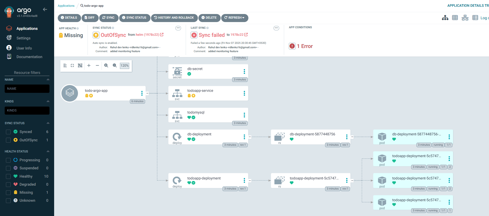
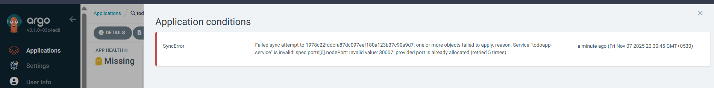

1. Commeted the nodeport, so that it will create random NodePort to prevent this error
   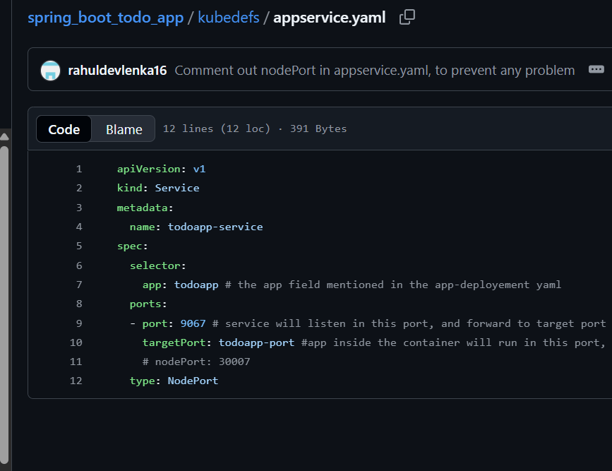

2. Result
   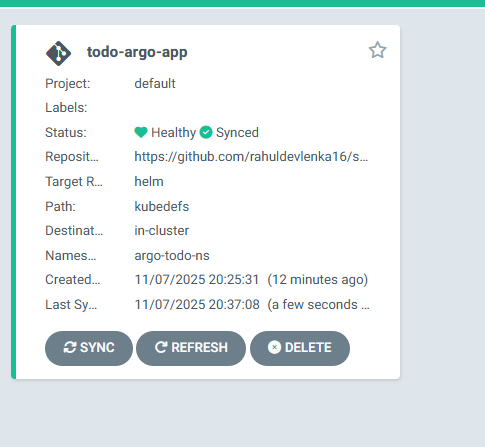